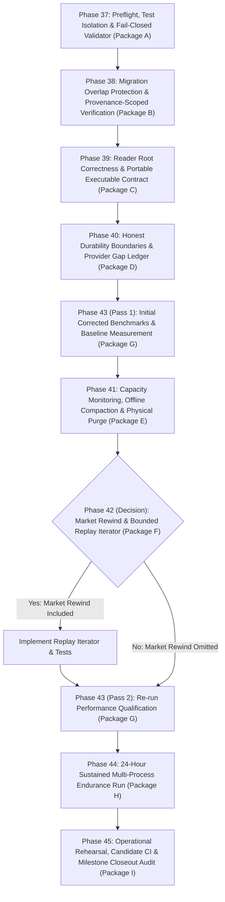

# Roadmap: Data Harvester

## Milestones

- ✅ **v1.0 Local DuckDB & 24/7 Live Streaming Engine** — Phases 1–4 (shipped 2026-09-25)
- ✅ **v2.0 Dedicated Dual-DuckDB Storage, Capital.com Tick Streamer & Data Integrity Web Dashboard** — Phases 5–9 (shipped 2026-09-25)
- ✅ **v3.0 Observability Command Center, Interactive Financial Charts & Live Telemetry Dashboard** — Phases 10–14 (shipped 2026-09-26)
- ✅ **v4.0 Partitioned Parquet Tick Lake (Decoupled High-Concurrency Storage)** — Phases 15–21 (shipped 2026-10-03)
- ✅ **v4.1 Partitioned Parquet Lake Deep Testing & Hardening** — Phases 22–27 (shipped 2026-10-03)
- ✅ **v4.2 Tick Lake Qualification & Scoped Signoff** — Phases 28–36 (closed 2026-10-04)
- 🟡 **v4.3 Final Tick-Lake Implementation and Verification** — Phases 37–45 (in progress)

## Phases

### Completed Milestones

✅ v4.2 Tick Lake Qualification & Scoped Signoff (Phases 28–36) — CLOSED 2026-10-04

- [x] Phase 28: CI Evidence & Requirement Traceability (1/1 plan) — completed 2026-10-04
- [x] Phase 29: Test Isolation & Independent Oracles (1/1 plan) — completed 2026-10-04
- [x] Phase 30: Production-Scale Performance Qualification (1/1 plan) — completed 2026-10-04
- [x] Phase 31: Endurance & Sustained Recovery (deferred to v4.3) — closed 2026-10-04
- [x] Phase 32: Durability Boundary & Capture-Gap Contract (1/1 plan) — completed 2026-10-04
- [x] Phase 33: Repo B Contract & Integration (1/1 plan) — completed 2026-10-04
- [x] Phase 34: Migration, Backup & Restore Rehearsal (1/1 plan) — completed 2026-10-04
- [x] Phase 35: Append-Only Capacity & Maintenance Safety (deferred to v4.3) — closed 2026-10-04
- [x] Phase 36: Contract Repair & Signoff Documentation (1/1 plan) — completed 2026-10-04

Result: 30 of 45 requirements verified; 15 requirements explicitly excluded/deferred (24h endurance, capacity monitoring, Q10a replay & Q10b compaction deferred to v4.3). Audit verdict: Scoped signoff with 15 explicitly excluded gates per `docs/plans/milestone-4.2-audit-report.md`. Two xfails pinned for v4.3 remediation (C43-01 date-filter duplicate, C43-02 staging verify).

See: [.planning/milestones/v4.2-ROADMAP.md](milestones/v4.2-ROADMAP.md) · [.planning/milestones/v4.2-REQUIREMENTS.md](milestones/v4.2-REQUIREMENTS.md) · [.planning/milestones/v4.2-MILESTONE-AUDIT.md](milestones/v4.2-MILESTONE-AUDIT.md) · [docs/plans/milestone-4.2-execution.md](../docs/plans/milestone-4.2-execution.md)

✅ v4.1 Partitioned Parquet Lake Deep Testing & Hardening (Phases 22–27) — SHIPPED 2026-10-03

- [x] Phase 22: Storage Foundation & Publication Edge Case Tests (1/1 plan) — completed 2026-10-03 (36/36 tests)
- [x] Phase 23: Streaming Writer & Runner Stress & Lifecycle Tests (1/1 plan) — completed 2026-10-03 (14/14 tests)
- [x] Phase 24: Versioned Symbol Registry & Dynamic Reload Stress Tests (1/1 plan) — completed 2026-10-03 (13/13 tests)
- [x] Phase 25: In-Memory DuckDB Lake Reader & Analytics Edge Tests (1/1 plan) — completed 2026-10-03 (17/17 tests)
- [x] Phase 26: Migration Tooling Rehearsal & Fuzz Tests (1/1 plan) — completed 2026-10-03 (32/32 tests)
- [x] Phase 27: Multi-Process Long-Running Soak & Chaos Tests (1/1 plan) — completed 2026-10-03 (10/10 tests)

Result: 122 new tests expanded to **746 passed offline tests** post-remediation (0 failures, 0 errors at closeout). Audit verdict: ✅ **`passed`** (F01–F11 remediated and verified; offline qualification passed; local performance gates passed).

See: [.planning/milestones/v4.1-ROADMAP.md](milestones/v4.1-ROADMAP.md) · [.planning/milestones/v4.1-REQUIREMENTS.md](milestones/v4.1-REQUIREMENTS.md) · [.planning/milestones/v4.1-MILESTONE-AUDIT.md](milestones/v4.1-MILESTONE-AUDIT.md) · [.planning/milestones/v4.1-quick/](milestones/v4.1-quick/)

✅ v4.0 Partitioned Parquet Tick Lake (Decoupled High-Concurrency Storage) (Phases 15–21) — SHIPPED 2026-10-03

- [x] Phase 15: Safe Test Isolation & Baseline Characterization (P0) (1/1 plan) — completed 2026-10-03
- [x] Phase 16: Lake Schema, Configuration, Atomic Files & Recovery (P1) (1/1 plan) — completed 2026-10-03
- [x] Phase 17: Streaming Parquet Writer & Runner Lifecycle Integration (P2) (1/1 plan) — completed 2026-10-03
- [x] Phase 18: Versioned Symbol Registry & Administrative Compatibility (P3) (1/1 plan) — completed 2026-10-03
- [x] Phase 19: In-Memory DuckDB Lake Reader & Dashboard Integration (P4) (1/1 plan) — completed 2026-10-03
- [x] Phase 20: Zero-Loss Migration Tooling & Rehearsal (P6) (1/1 plan) — completed 2026-10-03
- [x] Phase 21: Production Cutover, Concurrency Validation & Handoff (P8) (1/1 plan) — completed 2026-10-03

See: [.planning/milestones/v4.0-ROADMAP.md](milestones/v4.0-ROADMAP.md)

✅ v3.0 Observability Command Center, Interactive Financial Charts & Live Telemetry Dashboard (Phases 10–14) — SHIPPED 2026-09-26

- [x] Phase 10: Backend Analytics & High-Performance Data APIs (1/1 plan) — completed 2026-09-25
- [x] Phase 11: Interactive Financial Charting & Data Explorer UI (1/1 plan) — completed 2026-09-25
- [x] Phase 12: Live Stream Tape, Telemetry & Market Operations UI (1/1 plan) — completed 2026-09-25
- [x] Phase 13: Enhanced Symbol Data Matrix & Context-Aware Integrity Engine (1/1 plan) — completed 2026-09-25
- [x] Phase 14: Comprehensive Verification, Testing & Polish (1/1 plan) — completed 2026-09-25

See: [.planning/milestones/v3.0-ROADMAP.md](milestones/v3.0-ROADMAP.md)

✅ v2.0 Dedicated Dual-DuckDB Storage, Capital.com Tick Streamer & Data Integrity Web Dashboard (Phases 5–9) — SHIPPED 2026-09-25

- [x] Phase 5: Dedicated Dual-DuckDB Storage Layer (1/1 plan) — completed 2026-09-25
- [x] Phase 6: Capital.com Exclusive WebSocket Streamer & Dynamic Reload (1/1 plan) — completed 2026-09-25
- [x] Phase 7: Data Integrity & Health Engine (1/1 plan) — completed 2026-09-25
- [x] Phase 8: Interactive JavaScript Web Dashboard & Symbol Management (1/1 plan) — completed 2026-09-25
- [x] Phase 9: End-to-End Verification & Full Test Suite (1/1 plan) — completed 2026-09-25

See: [.planning/milestones/v2.0-ROADMAP.md](milestones/v2.0-ROADMAP.md)

✅ v1.0 Local DuckDB & 24/7 Live Streaming Engine (Phases 1–4) — SHIPPED 2026-09-25

- [x] Phase 1: Turso Data Migration & Legacy Purge (1/1 plan) — completed 2026-09-25
- [x] Phase 2: DuckDB Storage Engine (1/1 plan) — completed 2026-09-25
- [x] Phase 3: 24/7 Live WebSocket Streaming (1/1 plan) — completed 2026-09-25
- [x] Phase 4: Test Suite Migration & Verification (1/1 plan) — completed 2026-09-25

See: [.planning/milestones/v1.0-ROADMAP.md](milestones/v1.0-ROADMAP.md)

### 🟡 v4.3 Final Tick-Lake Implementation and Verification (In Progress)

**Milestone Goal:** Finish the historical DuckDB-to-Parquet migration and concurrent ingestion/analytics work, correct incomplete qualification, implement the remaining operational capabilities (capacity monitoring, offline compaction/purge if needed, market rewind decision & replay iterator, 24-hour endurance), and produce one final evidence-backed signoff with zero required unresolved gates.

**Source Plan:** [`docs/plans/milestone-4.3-final-concurrency-closeout.md`](../docs/plans/milestone-4.3-final-concurrency-closeout.md)

#### Scope & Agreed Adjustments

1. **Phase 37: Preflight, Test Isolation & Fail-Closed Validator (Package A)**: Safe run directories outside tracked artifacts; verify write guards; reject `--allow-deferred` on required failures in `tools/validate_release_report.py`; table-driven report mutation tests (C43-06).
2. **Phase 38: Migration Overlap Protection & Provenance-Scoped Verification (Package B)**: Source-coverage ledger independent of run scope (resolves C43-01 without payload deduplication); provenance-scoped final verification replacing C43-02 xfail (concurrent live rows outside migration do not trigger error); separate whole-lake audit detecting foreign/unowned files across namespaces; cutover and rollback rehearsal under real coordinator.
3. **Phase 39: Reader Root Correctness & Portable Executable Contract (Package C)**: Distinguish uninitialized/unavailable roots from legitimate empty lakes (no silent fallback to legacy DuckDB); barrier-controlled snapshot race test (C43-07) asserting complete snapshot or explicit snapshot-unavailable error (never partial silent reads); execute published markdown reader contract examples in isolated subprocess with zero internal repo imports.
4. **Phase 40: Honest Durability Boundaries & Provider Gap Ledger (Package D)**: Real OS SIGINT/SIGTERM runner lifecycle test verifying `_shutdown_signal_handler` and queue drain; assertion-bearing barriers at admission, intent, staged fsync, promotion, receipt, and ack; honest gap reporting recording explicit visible gap start/end and loss unknown when unquantifiable; guaranteed documented RAM loss boundary.
5. **Phase 43 (Pass 1): Initial Corrected Benchmarks & Baseline Measurement (Package G)**: Run initial corrected benchmarks before the Phase 41 compaction decision; >=19-symbol hot-skew datasets at 1M/10M scale to measure raw-partition query latency and fan-out; continuous background peak RSS/CPU sampling; real arrival-to-visible p99 latency through actual runner and separate reader; enforced qualification upper limits.
6. **Phase 41: Capacity Monitoring, Offline Compaction & Physical Purge (Package E) [x]**: Required capacity monitoring (files/day per symbol, small-file sizes, free space, rate-limited threshold warnings); conditional compaction implementation and tests if required by Phase 43 Pass 1 benchmark SLAs (with maintenance journal, consumer drain, multiset equivalence verification, immutable receipt lineage, and crash-safe promotion).
7. **Phase 42 (Decision): Market Rewind & Bounded Replay Iterator (Package F)**: Route Phase 41 into Phase 42 unconditionally. Decision branches:
   - **Yes (market rewind included in release)**: implement and test replay iterator (`src/storage/replay.py`, snapshot file inventory iterator, deterministic `(timestamp, symbol, ingest_id)` order, cursor resume across fresh processes) -> proceed to Phase 43 Pass 2.
   - **No (market rewind omitted)**: go directly to Phase 43 Pass 2.
8. **Phase 43 (Pass 2): Re-run Performance Qualification (Package G)**: Re-run qualification suite after any relevant runtime changes (e.g. compaction).
9. **Phase 44: 24-Hour Sustained Multi-Process Endurance Run (Package H)**: Duration-driven multi-process harness running continuously for at least 24 hours with real runner, dashboard, and independent reader under live synthetic ingestion; separate reconciliation for admitted, durable, published, and rejected records (ticks during documented provider gaps are not mistaken for lost durable records); bounded memory/handles; zero zombie processes.
10. **Phase 45: Operational Rehearsal, Candidate CI & Milestone Closeout Audit (Package I)**: Final candidate code freeze; execution of full offline test suite; authenticated candidate CI log verification; requirement-level traceability reconciliation; publish machine-readable release report and final evidence audit with no required unresolved gates.

#### Execution Flowchart

---

#### Phase 37: Preflight, Test Isolation & Fail-Closed Validator (Package A) [x]

**Status**: Completed 2026-10-04 (commit `a975647a`)
**Goal**: Establish safe test and benchmark execution outside tracked artifacts, enforce write guards, harden the release report validator against invalid evidence/omissions, and implement table-driven mutation tests.
**Depends on**: Nothing (entry phase of Milestone 4.3)
**Requirements**: [VALD-01, VALD-02, VALD-03, VALD-04]
**Success Criteria** (what must be TRUE):
  1. Unique run directory outside tracked artifacts is used for evidence; production write guards block dangerous paths and symlink aliases before writes.
  2. The release report validator consumes an authoritative required-gate inventory and strictly fails closed on missing gates, empty metrics, or required FAIL/BLOCKED gates.
  3. `--allow-deferred` waiver option strictly rejects FAIL or BLOCKED gates and never blesses an incomplete report for release.
  4. Table-driven report mutation tests demonstrate that the validator detects missing artifacts, directory inputs, zero latency, count mismatches, and mutated metrics (resolving C43-06).

**Plans**: 1 plan complete (commit `a975647a`)

---

#### Phase 38: Migration Overlap Protection & Provenance-Scoped Verification (Package B) [x]

**Status**: Completed 2026-10-04 (commit `0b76bad1`)
**Goal**: Implement source-coverage idempotence independent of run scope, replace the staging-only verification xfail with provenance-scoped final verification, and prove real coordinator cutover/rollback.
**Depends on**: Phase 37
**Requirements**: [MIGR-01, MIGR-02, MIGR-03, MIGR-04]
**Success Criteria** (what must be TRUE):
  1. Migration source-coverage ledger tracks covered source ranges independently of run UUID or query filters, preventing duplicate row publication (resolving C43-01 without payload deduplication).
  2. Final publication verification inspects the published Parquet inventory against the frozen source using bidirectional `EXCEPT ALL`, scoped strictly to migration-owned inventory so concurrent live rows do not cause false failures (resolving C43-02 without xfail).
  3. A separate complete-inventory audit detects foreign, unowned, or corrupted files across all lake namespaces.
  4. Cutover and rollback rehearsals pass through `MigrationHandoffCoordinator` and `ProcessSupervisor` with injected stalled drain and restart failures, preserving live post-cutover data.

**Plans**: 1 plan complete (commit `0b76bad1`)

---

#### Phase 39: Reader Root Correctness & Portable Executable Contract (Package C) [x]

**Status**: Completed 2026-10-04 (commit `4c18243b`)
**Goal**: Ensure the lake reader fails fast on uninitialized or unavailable roots without legacy DuckDB fallback, replace the file-deletion test with a barrier-controlled snapshot race, and execute the portable contract suite.
**Depends on**: Phase 37
**Requirements**: [READ-01, READ-02, READ-03, READ-04]
**Success Criteria** (what must be TRUE):
  1. The reader raises specific structured exceptions on uninitialized roots, lost mounts, corrupted metadata, or unreadable partitions, with zero silent fallback to `streaming.duckdb`.
  2. Valid empty lakes (no symbols or date ranges) return legitimate empty results without raising errors.
  3. Barrier-controlled snapshot race test captures the exact file list, removes a file during execution barrier, and asserts either complete results or an explicit snapshot-unavailable error (never silent partial reads; resolving C43-07).
  4. Published markdown contract examples execute in an isolated subprocess with zero internal `src` imports, verifying candle resampling accuracy across DST, timestamp ties, null volume, and late data.

**Plans**: 1 plan complete (commit `4c18243b`)

---

#### Phase 40: Honest Durability Boundaries & Provider Gap Ledger (Package D) [x]

**Status**: Completed 2026-10-05 (commit `3d7dd385`)
**Goal**: Pin the runner lifecycle and durability barrier crash matrix with real OS signals and subprocesses, and implement an honest sequence-ledgered provider gap reporting contract.
**Depends on**: Phase 37, Phase 38
**Requirements**: [DURB-01, DURB-02, DURB-03, DURB-04]
**Success Criteria** (what must be TRUE):
  1. Real OS SIGINT and SIGTERM lifecycle tests verify runner signal handling, cooperative queue drain, and clean exit codes.
  2. Crash matrix kills the writer at admission, intent durability, staged fsync, final promotion, directory fsync, receipt durability, and acknowledgment, reconciling against an independent external ledger in a fresh process.
  3. A fake provider with sequence ledgers and controllable disconnect/reconnect records explicit visible gap intervals with "loss unknown" when unquantifiable.
  4. The RAM-only loss boundary is verified and signed honestly as the guarantee limit; no power-loss or live zero-loss claims are made.

**Plans**: 1 plan complete (commit `3d7dd385`)

---

#### Phase 43: Production-Scale Benchmarks & Performance Qualification (Package G - Pass 1 & Pass 2) [x] (Pass 1)

**Status**: Pass 1 Completed 2026-10-05 (commit `e6414f78`); Pass 2 Pending (post-Phase 42)
**Goal**: Implement continuous resource sampling, real receive-to-visible p99 latency, and enforced qualification thresholds at 1M and 10M scales; execute Pass 1 to measure raw-partition query latency and fan-out before the compaction decision, and Pass 2 after runtime changes.
**Depends on**: Pass 1 depends on Phase 40; Pass 2 depends on Phase 42
**Requirements**: [PERF-01, PERF-02, PERF-03, PERF-04, PERF-05]
**Success Criteria** (what must be TRUE):
  1. Datasets generated with >=19 symbols, hot-symbol skew, and session/month windows at 1M and 10M rows reproduce with recorded manifests (resolving C43-05).
  2. Peak RSS and CPU are sampled continuously in the background throughout benchmarks, replacing `max(start, end)` snapshots.
  3. Real receive-to-visible freshness is measured through the actual runner and an independent reader process (healthy load p99 <= configured flush interval + 1 second; resolving C43-04).
  4. Qualification harness strictly enforces upper limits: warm session 1m/5m queries p95 <100ms, warm month daily candles p95 <250ms, writer CPU >=50% reduction vs legacy baseline, and event loop lag p99 <20ms (resolving C43-03).
  5. Pass 1 measures raw-partition fan-out latency to inform Phase 41 compaction; Pass 2 re-qualifies performance after compaction/replay changes.

**Plans**: 1 plan complete for Pass 1 (commit `e6414f78`)

---

#### Phase 41: Capacity Monitoring, Offline Compaction & Physical Purge (Package E) [x]

**Status**: Completed 2026-10-05 (commit `ef9e57fe`)
**Goal**: Deliver actionable capacity monitoring and alert thresholds; implement recoverable offline compaction and physical purge under a durable maintenance journal if required by Phase 43 Pass 1 benchmark SLAs.
**Depends on**: Phase 43 (Pass 1)
**Requirements**: [CAPA-01, CAPA-02, CAPA-03, CAPA-04]
**Success Criteria** (what must be TRUE):
  1. Capacity monitor tracks files/day by symbol, small-file distribution, intent/receipt growth, free disk space, and query discovery cost, with rate-limited warning and critical alerts.
  2. Maintenance journal and consumer drain protocol stops reader admission, drains active queries, pauses supervisor restarts, and refuses unmanaged external readers during maintenance.
  3. Offline compaction (if enabled by Pass 1 SLAs) writes consolidated files outside active globs, verifies multiset equivalence before replacement, and preserves an immutable receipt lineage map.
  4. Administrative symbol purge removes files only under an inactive fenced generation, with crash-safe recovery and rollback.

**Plans**: 1 plan complete (commit `ef9e57fe`)

---

#### Phase 42: Market Rewind & Bounded Replay Iterator Decision (Package F - Decision Gated)

**Goal**: Formally evaluate the Market Rewind release inclusion decision: if YES, implement and test the bounded deterministic replay iterator; if NO, document the omission and route directly to Pass 2 qualification.
**Depends on**: Phase 41
**Requirements**: [RPLY-01, RPLY-02, RPLY-03, RPLY-04]
**Success Criteria** (what must be TRUE):
  1. Release decision for Market Rewind / replay iterator is explicitly recorded (Yes -> implement; No -> omit and proceed).
  2. If included: `src/storage/replay.py` provides an iterator over explicit snapshot file inventories yielding Arrow batches without full-history RAM materialization.
  3. If included: deterministic total ordering `(timestamp, symbol, ingest_id)` with stable tie-breaking and cursor resumption survives fresh process restarts.
  4. Portable reader contract remains fully verified and operational regardless of the replay iterator inclusion decision.

**Plans**: 0 plans (run `/gsd-plan-phase 42` to break down)

---

#### Phase 44: 24-Hour Sustained Multi-Process Endurance Run (Package H)

**Goal**: Complete a duration-driven, continuous >=24-hour multi-process endurance run with live synthetic ingestion, periodic checkpointing, scheduled fault recovery, and exact four-category reconciliation.
**Depends on**: Phase 43 (Pass 2)
**Requirements**: [ENDR-01, ENDR-02, ENDR-03, ENDR-04, ENDR-05]
**Success Criteria** (what must be TRUE):
  1. The multi-process endurance harness runs continuously for at least 24 hours with real runner, dashboard, and independent reader under live synthetic ingestion.
  2. Telemetry continuously tracks per-process/aggregate CPU, RSS, handle counts, thread counts, and queue depth with bounded growth and zero zombie processes.
  3. Reconciliation separates admitted, durable, published, and rejected records against an external producer ledger; provider ticks during documented gaps are not misclassified as lost durable records.
  4. Scheduled faults (disconnects, restarts, transient I/O errors, maintenance windows) recover within declared deadlines with zero durable record loss.
  5. Harness fails closed: deliberate premature aborts or absent telemetry produce `INCOMPLETE` / failed qualification, never green.

**Plans**: 0 plans (run `/gsd-plan-phase 44` to break down)

---

#### Phase 45: Operational Rehearsal, Candidate CI & Milestone Closeout Audit (Package I)

**Goal**: Freeze the release candidate, verify hosted CI run logs, perform complete requirement-level traceability reconciliation, and publish the validated machine-readable release report and final milestone audit.
**Depends on**: Phases 37–44
**Requirements**: [AUDT-01, AUDT-02, AUDT-03, AUDT-04]
**Success Criteria** (what must be TRUE):
  1. Final candidate code freeze is established; full offline test suite executes with zero required xfails, skips, or unhandled errors.
  2. Authenticated hosted CI run URL, commit SHA, and test logs are verified.
  3. Requirement-level traceability matrix reconciles all Milestone 4.3 requirements, test nodes, and artifacts with zero contradictions.
  4. Machine-readable release report passes hardened validation with zero required unresolved gates; final `milestone-4.3-audit-report.md` is published.

**Plans**: 0 plans (run `/gsd-plan-phase 45` to break down)

---

## Progress

**Completed milestones:** v1.0 4/4 plans · v2.0 5/5 · v3.0 5/5 · v4.0 7/7 · v4.1 6/6 · v4.2 7/9 (scoped signoff closed; remaining scope carried into v4.3).

| Phase | Milestone | Plans Complete | Status | Completed |
|-------|-----------|----------------|--------|-----------|
| 37. Preflight, Isolation & Fail-Closed Validator | v4.3 | 1/1 | Complete | 2026-10-04 |
| 38. Migration Overlap & Provenance Verification | v4.3 | 1/1 | Complete | 2026-10-04 |
| 39. Reader Root Correctness & Executable Contract | v4.3 | 1/1 | Complete | 2026-10-04 |
| 40. Durability Boundaries & Provider Gap Ledger | v4.3 | 1/1 | Complete | 2026-10-05 |
| 43. Performance Benchmarks (Pass 1) | v4.3 | 1/1 | Complete | 2026-10-05 |
| 41. Capacity Monitoring, Offline Compaction & Purge | v4.3 | 0/TBD | Not started | - |
| 42. Market Rewind & Replay Iterator Decision | v4.3 | 0/TBD | Not started | - |
| 43. Performance Qualification (Pass 2) | v4.3 | 0/TBD | Not started | - |
| 44. 24-Hour Sustained Endurance Run | v4.3 | 0/TBD | Not started | - |
| 45. Candidate CI & Milestone Closeout Audit | v4.3 | 0/TBD | Not started | - |

---

## Milestone Backlog

Follow-up triage against Milestone 4.3:

| Candidate | Disposition | Phase |
|-----------|-------------|-------|
| Fail-closed release report validator & mutation tests (C43-06) | **Required** | Phase 37 |
| Source-coverage idempotence without payload deduplication (C43-01) | **Required** | Phase 38 |
| Provenance-scoped final publication verification & whole-lake audit (C43-02) | **Required** | Phase 38 |
| Production cutover, rollback & restore rehearsal under supervisor | **Required** | Phase 38 |
| Fast reader fail on invalid roots without legacy fallback | **Required** | Phase 39 |
| Barrier-controlled snapshot race test & doc correction (C43-07) | **Required** | Phase 39 |
| Subprocess-isolated executable reader contract tests | **Required** | Phase 39 |
| Real OS SIGINT/SIGTERM runner lifecycle & queue drain test | **Required** | Phase 40 |
| Durability barrier crash matrix & external producer ledger (C43-08) | **Required** | Phase 40 |
| Fake provider sequence ledger & honest gap accounting | **Required** | Phase 40 |
| Corrected benchmarks: >=19 symbols, continuous peak RSS/CPU sampling (C43-03, C43-05) | **Required** | Phase 43 |
| Arrival-to-visible p99 latency through actual runner & reader (C43-04) | **Required** | Phase 43 |
| Capacity monitoring, files/day, small-file sizes, and disk alerts | **Required** | Phase 41 |
| Coordinated offline compaction & physical purge (conditional on Pass 1 SLAs) | **Conditional** | Phase 41 |
| Market Rewind release decision & bounded replay iterator | **Decision-Gated** | Phase 42 |
| 24-hour continuous multi-process endurance qualification | **Required** | Phase 44 |
| Authenticated hosted candidate CI log verification | **Required** | Phase 45 |
| Full traceability reconciliation & fail-closed final release report | **Required** | Phase 45 |
| Durable disk spool (`_spool/`) for power failure zero-loss | **Out of scope** | RAM loss boundary is guaranteed; spooling is optional extension |
