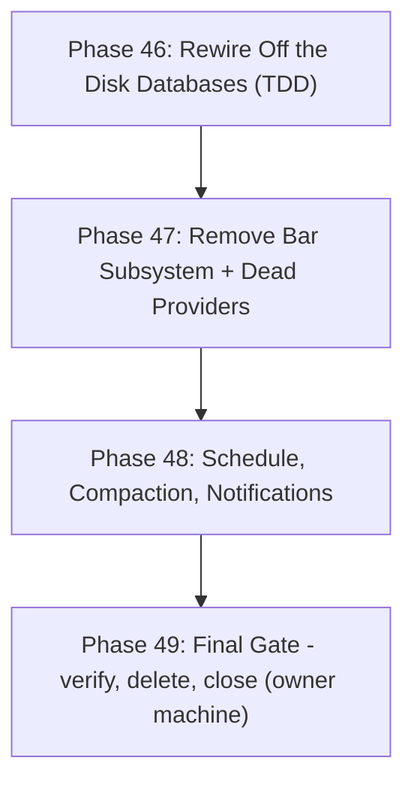

# Roadmap: Data Harvester

## Milestones

- ✅ **v1.0 Local DuckDB & 24/7 Live Streaming Engine** — Phases 1–4 (shipped 2026-09-25)
- ✅ **v2.0 Dedicated Dual-DuckDB Storage, Capital.com Tick Streamer & Data Integrity Web Dashboard** — Phases 5–9 (shipped 2026-09-25)
- ✅ **v3.0 Observability Command Center, Interactive Financial Charts & Live Telemetry Dashboard** — Phases 10–14 (shipped 2026-09-26)
- ✅ **v4.0 Partitioned Parquet Tick Lake (Decoupled High-Concurrency Storage)** — Phases 15–21 (shipped 2026-10-03)
- ✅ **v4.1 Partitioned Parquet Lake Deep Testing & Hardening** — Phases 22–27 (shipped 2026-10-03)
- ✅ **v4.2 Tick Lake Qualification & Scoped Signoff** — Phases 28–36 (closed 2026-10-04)
- ✅ **v4.3 Final Tick-Lake Implementation and Verification** — Phases 37–43 (44–45 waived; closed 2026-10-05)
- 🟡 **v5.0 Parquet-Only Storage (DuckDB retained as query engine)** — Phases 46–49 (in progress; order = number)

## Phases

### Completed Milestones

✅ v4.2 Tick Lake Qualification & Scoped Signoff (Phases 28–36) — CLOSED 2026-10-04

- [x] Phase 28: CI Evidence & Requirement Traceability (1/1 plan) — completed 2026-10-04
- [x] Phase 29: Test Isolation & Independent Oracles (1/1 plan) — completed 2026-10-04
- [x] Phase 30: Production-Scale Performance Qualification (1/1 plan) — completed 2026-10-04
- [x] Phase 31: Endurance & Sustained Recovery (deferred to v4.3) — closed 2026-10-04
- [x] Phase 32: Durability Boundary & Capture-Gap Contract (1/1 plan) — completed 2026-10-04
- [x] Phase 33: Repo B Contract & Integration (1/1 plan) — completed 2026-10-04
- [x] Phase 34: Migration, Backup & Restore Rehearsal (1/1 plan) — completed 2026-10-04
- [x] Phase 35: Append-Only Capacity & Maintenance Safety (deferred to v4.3) — closed 2026-10-04
- [x] Phase 36: Contract Repair & Signoff Documentation (1/1 plan) — completed 2026-10-04

Result: 30 of 45 requirements verified; 15 requirements explicitly excluded/deferred (24h endurance, capacity monitoring, Q10a replay & Q10b compaction deferred to v4.3). Audit verdict: Scoped signoff with 15 explicitly excluded gates per `docs/plans/milestone-4.2-audit-report.md`. Two xfails pinned for v4.3 remediation (C43-01 date-filter duplicate, C43-02 staging verify).

See: [.planning/milestones/v4.2-ROADMAP.md](milestones/v4.2-ROADMAP.md) · [.planning/milestones/v4.2-REQUIREMENTS.md](milestones/v4.2-REQUIREMENTS.md) · [.planning/milestones/v4.2-MILESTONE-AUDIT.md](milestones/v4.2-MILESTONE-AUDIT.md) · [docs/plans/milestone-4.2-execution.md](../docs/plans/milestone-4.2-execution.md)

✅ v4.1 Partitioned Parquet Lake Deep Testing & Hardening (Phases 22–27) — SHIPPED 2026-10-03

- [x] Phase 22: Storage Foundation & Publication Edge Case Tests (1/1 plan) — completed 2026-10-03 (36/36 tests)
- [x] Phase 23: Streaming Writer & Runner Stress & Lifecycle Tests (1/1 plan) — completed 2026-10-03 (14/14 tests)
- [x] Phase 24: Versioned Symbol Registry & Dynamic Reload Stress Tests (1/1 plan) — completed 2026-10-03 (13/13 tests)
- [x] Phase 25: In-Memory DuckDB Lake Reader & Analytics Edge Tests (1/1 plan) — completed 2026-10-03 (17/17 tests)
- [x] Phase 26: Migration Tooling Rehearsal & Fuzz Tests (1/1 plan) — completed 2026-10-03 (32/32 tests)
- [x] Phase 27: Multi-Process Long-Running Soak & Chaos Tests (1/1 plan) — completed 2026-10-03 (10/10 tests)

Result: 122 new tests expanded to **746 passed offline tests** post-remediation (0 failures, 0 errors at closeout). Audit verdict: ✅ **`passed`** (F01–F11 remediated and verified; offline qualification passed; local performance gates passed).

See: [.planning/milestones/v4.1-ROADMAP.md](milestones/v4.1-ROADMAP.md) · [.planning/milestones/v4.1-REQUIREMENTS.md](milestones/v4.1-REQUIREMENTS.md) · [.planning/milestones/v4.1-MILESTONE-AUDIT.md](milestones/v4.1-MILESTONE-AUDIT.md) · [.planning/milestones/v4.1-quick/](milestones/v4.1-quick/)

✅ v4.0 Partitioned Parquet Tick Lake (Decoupled High-Concurrency Storage) (Phases 15–21) — SHIPPED 2026-10-03

- [x] Phase 15: Safe Test Isolation & Baseline Characterization (P0) (1/1 plan) — completed 2026-10-03
- [x] Phase 16: Lake Schema, Configuration, Atomic Files & Recovery (P1) (1/1 plan) — completed 2026-10-03
- [x] Phase 17: Streaming Parquet Writer & Runner Lifecycle Integration (P2) (1/1 plan) — completed 2026-10-03
- [x] Phase 18: Versioned Symbol Registry & Administrative Compatibility (P3) (1/1 plan) — completed 2026-10-03
- [x] Phase 19: In-Memory DuckDB Lake Reader & Dashboard Integration (P4) (1/1 plan) — completed 2026-10-03
- [x] Phase 20: Zero-Loss Migration Tooling & Rehearsal (P6) (1/1 plan) — completed 2026-10-03
- [x] Phase 21: Production Cutover, Concurrency Validation & Handoff (P8) (1/1 plan) — completed 2026-10-03

See: [.planning/milestones/v4.0-ROADMAP.md](milestones/v4.0-ROADMAP.md)

✅ v3.0 Observability Command Center, Interactive Financial Charts & Live Telemetry Dashboard (Phases 10–14) — SHIPPED 2026-09-26

- [x] Phase 10: Backend Analytics & High-Performance Data APIs (1/1 plan) — completed 2026-09-25
- [x] Phase 11: Interactive Financial Charting & Data Explorer UI (1/1 plan) — completed 2026-09-25
- [x] Phase 12: Live Stream Tape, Telemetry & Market Operations UI (1/1 plan) — completed 2026-09-25
- [x] Phase 13: Enhanced Symbol Data Matrix & Context-Aware Integrity Engine (1/1 plan) — completed 2026-09-25
- [x] Phase 14: Comprehensive Verification, Testing & Polish (1/1 plan) — completed 2026-09-25

See: [.planning/milestones/v3.0-ROADMAP.md](milestones/v3.0-ROADMAP.md)

✅ v2.0 Dedicated Dual-DuckDB Storage, Capital.com Tick Streamer & Data Integrity Web Dashboard (Phases 5–9) — SHIPPED 2026-09-25

- [x] Phase 5: Dedicated Dual-DuckDB Storage Layer (1/1 plan) — completed 2026-09-25
- [x] Phase 6: Capital.com Exclusive WebSocket Streamer & Dynamic Reload (1/1 plan) — completed 2026-09-25
- [x] Phase 7: Data Integrity & Health Engine (1/1 plan) — completed 2026-09-25
- [x] Phase 8: Interactive JavaScript Web Dashboard & Symbol Management (1/1 plan) — completed 2026-09-25
- [x] Phase 9: End-to-End Verification & Full Test Suite (1/1 plan) — completed 2026-09-25

See: [.planning/milestones/v2.0-ROADMAP.md](milestones/v2.0-ROADMAP.md)

✅ v1.0 Local DuckDB & 24/7 Live Streaming Engine (Phases 1–4) — SHIPPED 2026-09-25

- [x] Phase 1: Turso Data Migration & Legacy Purge (1/1 plan) — completed 2026-09-25
- [x] Phase 2: DuckDB Storage Engine (1/1 plan) — completed 2026-09-25
- [x] Phase 3: 24/7 Live WebSocket Streaming (1/1 plan) — completed 2026-09-25
- [x] Phase 4: Test Suite Migration & Verification (1/1 plan) — completed 2026-09-25

See: [.planning/milestones/v1.0-ROADMAP.md](milestones/v1.0-ROADMAP.md)

### ✅ v4.3 Final Tick-Lake Implementation and Verification — CLOSED 2026-10-05

Phases 37–43 completed: fail-closed release validator, migration coverage ledger and provenance-scoped verification, reader fail-fast with no legacy fallback, durability barrier crash matrix, capacity monitoring and offline compaction, bounded replay iterator, and corrected benchmarks.

**Waived by owner:** Phase 44 (24-hour endurance) and Phase 45 (hosted CI + closeout audit). Neither adds capability; both require external infrastructure.

**Honest note:** the Phase 43 writer-CPU gate (`>= 50%` reduction vs legacy) was **not met** — measured `−14.4%`, and `reports/benchmarks/pass2_qualification_report.json` records `"overall_passed": false`. It is recorded as a measured characterization, not a pass.

Archive: [milestones/v4.3-ROADMAP.md](milestones/v4.3-ROADMAP.md) · [milestones/v4.3-REQUIREMENTS.md](milestones/v4.3-REQUIREMENTS.md) · [milestones/v4.3-phases/](milestones/v4.3-phases/)

---

### 🟢 v5.0 Parquet-Only Storage (DuckDB retained as query engine) — code phases complete, Phase 49 owner-run

**Milestone Goal:** Remove DuckDB as **storage**. No `.duckdb` files exist; all persisted market data is Parquet ticks. DuckDB remains as the in-memory query engine reading those files.

**Scope decision (owner, 2026-10-05):** the larger alternative — removing the DuckDB library and reimplementing resampling in PyArrow — was considered and **rejected**. Accordingly `src/storage/reader.py` and `compaction.py` are **not modified** by this milestone; `src/storage/replay.py` was deleted in Phase 47 (RMV-08, owner decision), which is a removal, not a rewrite.

**Source plan:** [`PLAN-MILESTONE-5.0.md`](../PLAN-MILESTONE-5.0.md)

**⚠ Hard sequencing constraint:** the legacy tick migration must be verified (**Phase 49**) **before** any `.duckdb` file is deleted. The migration tool uses DuckDB to read the legacy source. The agent never copies, exports, archives or deletes the owner's database files.

#### Execution Flowchart

**Working method (owner directive, 2026-10-05): test-driven.** Every phase: research -> write failing tests -> implement -> verify -> re-implement and re-verify on failure. A phase is complete only when its tests pass.

**Ordering note (2026-10-05):** phases were renumbered so numbers run in execution order. The former Phase 46 (migration gate) is now **Phase 49**; the former Phase 47 (rewiring) is now **Phase 46**. Code phases run first because they need no owner machine and no `data/` directory.

#### Phase 46: Rewire Off the Disk Databases

**Status:** ✅ Complete 2026-10-05 (STOR-01..05, DASH-01..03, BASE-01, GAP-01/02).
**Goal:** Capture the reference candle behaviour first, then make normal runtime unable to open a disk-backed DuckDB database, with the lake as the only source for ticks, symbols and dashboard reads.
**Depends on:** Nothing (entry phase). Runs entirely in this checkout.
**Requirements:** [BASE-01, STOR-01, STOR-02, STOR-03, STOR-04, STOR-05, DASH-01, DASH-02, DASH-03, GAP-01, GAP-02]
**Success criteria:**
1. Lake candle output is recorded once as the reference **before** any code change (BASE-01).
2. No runtime path opens or creates a disk-backed DuckDB database; a startup regression proves it.
3. `runner.py` is lake-only - the DuckDB writer fallback is removed, not merely disabled.
4. Symbols come from `_control/registry.json`.
5. Dashboard, analytics and integrity read the lake; the in-memory helper survives relocation.
6. Databento gap-fill publishes to the lake and respects maintenance fences.

#### Phase 47: Remove the Historical Bar Archive & Dead Providers

**Status:** ✅ Complete 2026-10-05 (RMV-01..04, 06..10; guards `tests/test_bar_era_removal.py`, `tests/test_disk_database_layer_removed.py`).
**Goal:** Delete everything whose only purpose was the 1-minute bar archive (the Massive/Polygon/Yahoo/Binance harvesters, their CLI and dashboard job) or an unrequested feature, and clean the surviving surface.

**Explicitly retained:** the tick-lake gap visualisation — shaded missing-data regions, continuity ribbons and `detect_stream_quiet_intervals`. This phase removes bar *storage*, never the chart that shows where data is missing.
**Depends on:** Phase 46
**Requirements:** [RMV-01, RMV-02, RMV-03, RMV-04, RMV-06, RMV-07, RMV-08, RMV-09]
**Success criteria:**
1. No reference to either `.duckdb` file remains in code or current docs.
2. Bar-archive pipeline, providers, harvester job, dead tools and the unused replay subsystem removed; `discord.py` rewritten for streamer notifications (not deleted). Gap shading and continuity ribbons untouched (`tests/dashboard/test_gap_visualisation_survives.py` stays green).
3. `yfinance` and `polygon-api-client` gone; **`duckdb` stays**.
4. `.planning/` archives untouched.

> RMV-05 (owner deletion of the two `.duckdb` files) lives in Phase 49 with the final gate.

#### Phase 48: Schedule, Off-Hours Compaction, Notifications & Test Disposition

**Status:** ✅ Complete 2026-10-05 (SCHED-01..05, SYMB-01, NOTIF-01, CO-01/02; full offline suite 988 passed).
**Goal:** Enforce 04:00-20:00 ET weekday ingestion, run compaction unattended in the closed interval, restrict the registry to 19 symbols, notify, and disposition the test suite.
**Depends on:** Phase 47
**Requirements:** [SCHED-01, SCHED-02, SCHED-03, SCHED-04, SCHED-05, SYMB-01, NOTIF-01, CO-01, CO-02]
**Success criteria:**
1. Eligibility computed in `America/New_York` with an injectable clock; DST-correct; weekdays only.
2. Supervisor lifecycle states; no provider activity outside the window; an intentional stop is not a crash.
3. Admission stops at 20:00, accepted ticks drain exactly once, a failed drain blocks compaction and is reported.
4. Compaction is idempotent per closed interval under a single maintenance lease.
5. Registry holds exactly the 19 approved symbols; out-of-scope symbols rejected at the callback boundary.
6. Discord notifications fire for session start/stop, **failed start**, restart and maintenance failure.
7. Every surviving test is dispositioned retain/retarget/delete with a reason; the offline suite passes.
8. Candle behaviour verified unchanged against the Phase 46 baseline.

#### Phase 49: Final Gate, Deletion & Closure

**Status:** ⏳ Owner-run; procedure rehearsed against a synthetic legacy database and published as [`docs/operations/phase49_migration_runbook.md`](../docs/operations/phase49_migration_runbook.md).
**Goal:** Verify the lake holds what the legacy tick store held, delete both `.duckdb` files, and close the milestone.
**Depends on:** Phase 48. **Runs on the owner's machine** - this checkout has no `data/` directory.
**Requirements:** [MIG-01, MIG-02, MIG-03, RMV-05, CO-03]
**Success criteria:**
1. Legacy tick source migrated with `verify-published` and `audit-lake` clean, reconciled per symbol and date.
2. Re-running over an overlapping or broader scope publishes no duplicate rows.
3. Owner confirms, then deletes both `.duckdb` files - no retention period.
4. One completion report; the milestone stops.

---

## Progress

**Completed milestones:** v1.0 4/4 plans · v2.0 5/5 · v3.0 5/5 · v4.0 7/7 · v4.1 6/6 · v4.2 7/9 · v4.3 7/9 (phases 44-45 waived; closed 2026-10-05).

| Phase | Milestone | Plans Complete | Status | Completed |
|-------|-----------|----------------|--------|-----------|
| 46. Rewire Off the Disk Databases | v5.0 | 1/1 | Complete ✅ | 2026-10-05 |
| 47. Remove Bar Subsystem & Dead Providers | v5.0 | 1/1 | Complete ✅ | 2026-10-05 |
| 48. Schedule, Compaction, Notifications & Test Disposition | v5.0 | 1/1 | Complete ✅ | 2026-10-05 |
| 49. Final Gate, Deletion & Closure (owner machine) | v5.0 | — | Not started — owner-run, runbook §1–§5 | — |

**Suite state at handoff:** 988 passed, 0 failures, 0 xfails (`pytest tests/ -q`), branch tip
`a706406` on `arena/01a10aa6-data-harvester`, PR #9.

---

## Milestone Backlog

v4.3 backlog items are archived with that milestone. Active backlog for v5.0:

| Candidate | Disposition | Phase |
|-----------|-------------|-------|
| Verify legacy tick migration before any `.duckdb` deletion | **Required (gate)** | 49 |
| Runner lake-only; remove DuckDB writer fallback | **Required** | 46 |
| Dashboard, analytics, integrity off the disk databases | **Required** | 46 |
| Databento gap-fill rewired to the Parquet lake | **Required** | 46 |
| Bar subsystem and dead providers removed; Discord rewritten (not removed) | **Required** | 47 |
| Unused replay subsystem removal (`replay.py`, exports, reader methods, tests) | **Required** | 47 |
| Discord rewired to streamer events (bar-era functions removed) | **Required** | 47-48 |
| Owner deletion of `historical.duckdb` + `streaming.duckdb` (no retention period) | **Owner action** | 49 |
| Single Parquet-only dashboard (Historical view deleted) | **Required** | 46 |
| 04:00–20:00 ET weekday schedule + unattended off-hours compaction | **Required** | 48 |
| Removing the DuckDB library / PyArrow resampling | **Out of scope** (owner-rejected) | — |
| 24-hour endurance run, hosted CI log verification | **Out of scope** (waived in v4.3) | — |
| Postgres / SQLite migration | **Out of scope** (rejected) | — |
