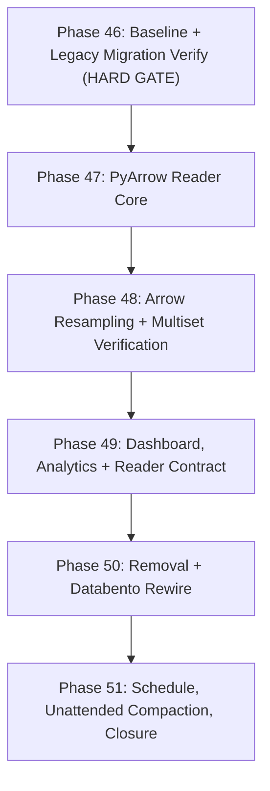

# Roadmap: Data Harvester

## Milestones

- ✅ **v1.0 Local DuckDB & 24/7 Live Streaming Engine** — Phases 1–4 (shipped 2026-09-25)
- ✅ **v2.0 Dedicated Dual-DuckDB Storage, Capital.com Tick Streamer & Data Integrity Web Dashboard** — Phases 5–9 (shipped 2026-09-25)
- ✅ **v3.0 Observability Command Center, Interactive Financial Charts & Live Telemetry Dashboard** — Phases 10–14 (shipped 2026-09-26)
- ✅ **v4.0 Partitioned Parquet Tick Lake (Decoupled High-Concurrency Storage)** — Phases 15–21 (shipped 2026-10-03)
- ✅ **v4.1 Partitioned Parquet Lake Deep Testing & Hardening** — Phases 22–27 (shipped 2026-10-03)
- ✅ **v4.2 Tick Lake Qualification & Scoped Signoff** — Phases 28–36 (closed 2026-10-04)
- ✅ **v4.3 Final Tick-Lake Implementation and Verification** — Phases 37–43 (44–45 waived; closed 2026-10-05)
- 🟡 **v5.0 DuckDB-Free Tick-Only Parquet** — Phases 46–51 (in progress)

## Phases

### Completed Milestones

✅ v4.2 Tick Lake Qualification & Scoped Signoff (Phases 28–36) — CLOSED 2026-10-04

- [x] Phase 28: CI Evidence & Requirement Traceability (1/1 plan) — completed 2026-10-04
- [x] Phase 29: Test Isolation & Independent Oracles (1/1 plan) — completed 2026-10-04
- [x] Phase 30: Production-Scale Performance Qualification (1/1 plan) — completed 2026-10-04
- [x] Phase 31: Endurance & Sustained Recovery (deferred to v4.3) — closed 2026-10-04
- [x] Phase 32: Durability Boundary & Capture-Gap Contract (1/1 plan) — completed 2026-10-04
- [x] Phase 33: Repo B Contract & Integration (1/1 plan) — completed 2026-10-04
- [x] Phase 34: Migration, Backup & Restore Rehearsal (1/1 plan) — completed 2026-10-04
- [x] Phase 35: Append-Only Capacity & Maintenance Safety (deferred to v4.3) — closed 2026-10-04
- [x] Phase 36: Contract Repair & Signoff Documentation (1/1 plan) — completed 2026-10-04

Result: 30 of 45 requirements verified; 15 requirements explicitly excluded/deferred (24h endurance, capacity monitoring, Q10a replay & Q10b compaction deferred to v4.3). Audit verdict: Scoped signoff with 15 explicitly excluded gates per `docs/plans/milestone-4.2-audit-report.md`. Two xfails pinned for v4.3 remediation (C43-01 date-filter duplicate, C43-02 staging verify).

See: [.planning/milestones/v4.2-ROADMAP.md](milestones/v4.2-ROADMAP.md) · [.planning/milestones/v4.2-REQUIREMENTS.md](milestones/v4.2-REQUIREMENTS.md) · [.planning/milestones/v4.2-MILESTONE-AUDIT.md](milestones/v4.2-MILESTONE-AUDIT.md) · [docs/plans/milestone-4.2-execution.md](../docs/plans/milestone-4.2-execution.md)

✅ v4.1 Partitioned Parquet Lake Deep Testing & Hardening (Phases 22–27) — SHIPPED 2026-10-03

- [x] Phase 22: Storage Foundation & Publication Edge Case Tests (1/1 plan) — completed 2026-10-03 (36/36 tests)
- [x] Phase 23: Streaming Writer & Runner Stress & Lifecycle Tests (1/1 plan) — completed 2026-10-03 (14/14 tests)
- [x] Phase 24: Versioned Symbol Registry & Dynamic Reload Stress Tests (1/1 plan) — completed 2026-10-03 (13/13 tests)
- [x] Phase 25: In-Memory DuckDB Lake Reader & Analytics Edge Tests (1/1 plan) — completed 2026-10-03 (17/17 tests)
- [x] Phase 26: Migration Tooling Rehearsal & Fuzz Tests (1/1 plan) — completed 2026-10-03 (32/32 tests)
- [x] Phase 27: Multi-Process Long-Running Soak & Chaos Tests (1/1 plan) — completed 2026-10-03 (10/10 tests)

Result: 122 new tests expanded to **746 passed offline tests** post-remediation (0 failures, 0 errors at closeout). Audit verdict: ✅ **`passed`** (F01–F11 remediated and verified; offline qualification passed; local performance gates passed).

See: [.planning/milestones/v4.1-ROADMAP.md](milestones/v4.1-ROADMAP.md) · [.planning/milestones/v4.1-REQUIREMENTS.md](milestones/v4.1-REQUIREMENTS.md) · [.planning/milestones/v4.1-MILESTONE-AUDIT.md](milestones/v4.1-MILESTONE-AUDIT.md) · [.planning/milestones/v4.1-quick/](milestones/v4.1-quick/)

✅ v4.0 Partitioned Parquet Tick Lake (Decoupled High-Concurrency Storage) (Phases 15–21) — SHIPPED 2026-10-03

- [x] Phase 15: Safe Test Isolation & Baseline Characterization (P0) (1/1 plan) — completed 2026-10-03
- [x] Phase 16: Lake Schema, Configuration, Atomic Files & Recovery (P1) (1/1 plan) — completed 2026-10-03
- [x] Phase 17: Streaming Parquet Writer & Runner Lifecycle Integration (P2) (1/1 plan) — completed 2026-10-03
- [x] Phase 18: Versioned Symbol Registry & Administrative Compatibility (P3) (1/1 plan) — completed 2026-10-03
- [x] Phase 19: In-Memory DuckDB Lake Reader & Dashboard Integration (P4) (1/1 plan) — completed 2026-10-03
- [x] Phase 20: Zero-Loss Migration Tooling & Rehearsal (P6) (1/1 plan) — completed 2026-10-03
- [x] Phase 21: Production Cutover, Concurrency Validation & Handoff (P8) (1/1 plan) — completed 2026-10-03

See: [.planning/milestones/v4.0-ROADMAP.md](milestones/v4.0-ROADMAP.md)

✅ v3.0 Observability Command Center, Interactive Financial Charts & Live Telemetry Dashboard (Phases 10–14) — SHIPPED 2026-09-26

- [x] Phase 10: Backend Analytics & High-Performance Data APIs (1/1 plan) — completed 2026-09-25
- [x] Phase 11: Interactive Financial Charting & Data Explorer UI (1/1 plan) — completed 2026-09-25
- [x] Phase 12: Live Stream Tape, Telemetry & Market Operations UI (1/1 plan) — completed 2026-09-25
- [x] Phase 13: Enhanced Symbol Data Matrix & Context-Aware Integrity Engine (1/1 plan) — completed 2026-09-25
- [x] Phase 14: Comprehensive Verification, Testing & Polish (1/1 plan) — completed 2026-09-25

See: [.planning/milestones/v3.0-ROADMAP.md](milestones/v3.0-ROADMAP.md)

✅ v2.0 Dedicated Dual-DuckDB Storage, Capital.com Tick Streamer & Data Integrity Web Dashboard (Phases 5–9) — SHIPPED 2026-09-25

- [x] Phase 5: Dedicated Dual-DuckDB Storage Layer (1/1 plan) — completed 2026-09-25
- [x] Phase 6: Capital.com Exclusive WebSocket Streamer & Dynamic Reload (1/1 plan) — completed 2026-09-25
- [x] Phase 7: Data Integrity & Health Engine (1/1 plan) — completed 2026-09-25
- [x] Phase 8: Interactive JavaScript Web Dashboard & Symbol Management (1/1 plan) — completed 2026-09-25
- [x] Phase 9: End-to-End Verification & Full Test Suite (1/1 plan) — completed 2026-09-25

See: [.planning/milestones/v2.0-ROADMAP.md](milestones/v2.0-ROADMAP.md)

✅ v1.0 Local DuckDB & 24/7 Live Streaming Engine (Phases 1–4) — SHIPPED 2026-09-25

- [x] Phase 1: Turso Data Migration & Legacy Purge (1/1 plan) — completed 2026-09-25
- [x] Phase 2: DuckDB Storage Engine (1/1 plan) — completed 2026-09-25
- [x] Phase 3: 24/7 Live WebSocket Streaming (1/1 plan) — completed 2026-09-25
- [x] Phase 4: Test Suite Migration & Verification (1/1 plan) — completed 2026-09-25

See: [.planning/milestones/v1.0-ROADMAP.md](milestones/v1.0-ROADMAP.md)

### ✅ v4.3 Final Tick-Lake Implementation and Verification — CLOSED 2026-10-05

Phases 37–43 completed: fail-closed release validator, migration coverage ledger and provenance-scoped verification, reader fail-fast with no legacy fallback, durability barrier crash matrix, capacity monitoring and offline compaction, bounded replay iterator, and corrected benchmarks.

**Waived by owner:** Phase 44 (24-hour endurance) and Phase 45 (hosted CI + closeout audit). Neither adds capability; both require external infrastructure.

**Honest note:** the Phase 43 writer-CPU gate (`>= 50%` reduction vs legacy) was **not met** — measured `−14.4%`, and `reports/benchmarks/pass2_qualification_report.json` records `"overall_passed": false`. It is recorded as a measured characterization, not a pass.

Archive: [milestones/v4.3-ROADMAP.md](milestones/v4.3-ROADMAP.md) · [milestones/v4.3-REQUIREMENTS.md](milestones/v4.3-REQUIREMENTS.md) · [milestones/v4.3-phases/](milestones/v4.3-phases/)

---

### 🟡 v5.0 DuckDB-Free Tick-Only Parquet (In Progress)

**Milestone Goal:** Reduce the system to one storage format, one query engine, and one data type — ticks in Parquet, read with PyArrow. DuckDB is removed entirely, including as the analytical engine. Ingestion is restricted to 04:00–20:00 ET for the 19 approved equity symbols, with compaction running unattended in the closed window.

**Source plan:** [`PLAN-MILESTONE-5.0.md`](../PLAN-MILESTONE-5.0.md)

**⚠ Hard sequencing constraint:** the legacy tick migration must complete and verify (Phase 46) **before** any DuckDB removal (Phase 50). The migration tool uses DuckDB to read the legacy source file.

#### Execution Flowchart

#### Phase 46: Baseline Capture & Legacy Tick Migration Verification

**Goal:** Record the reference behaviour the PyArrow implementation must match, and complete + verify the legacy tick migration while DuckDB is still present.
**Depends on:** Nothing (entry phase)
**Requirements:** [BASE-01, MIG-01, MIG-02, MIG-03]
**Success criteria:**
1. A single recorded baseline exists — candle edge-case matrix (DST, ties, duplicates, nulls) plus query/tape latency.
2. Migration completes with `verify-published` and `audit-lake` clean, reconciled per symbol and per date.
3. Re-running over an overlapping scope publishes no duplicate rows.
4. Owner confirmation is recorded before any DuckDB removal.

#### Phase 47: PyArrow Reader Core

**Goal:** Reimplement `TickLakeReader` on PyArrow with an identical public API and identical error semantics.
**Depends on:** Phase 46
**Requirements:** [READ-01, READ-02, READ-03, READ-04, READ-05]
**Success criteria:**
1. No DuckDB import in the reader module; all public method names and return shapes preserved.
2. Partition pruning and structured lake errors unchanged; no silent fallback.
3. Duplicate multiplicity, null volume and `(timestamp, ingest_id)` ordering preserved.
4. Memory bounded per symbol/day partition.

#### Phase 48: Arrow Resampling & Multiset Verification

**Goal:** Replace `time_bucket` / `arg_min` / `arg_max` resampling and `EXCEPT ALL` reconciliation with Arrow and Counter equivalents that match the oracle exactly.
**Depends on:** Phase 47
**Requirements:** [CAND-01, CAND-02, VER-01, VER-02, VER-03]
**Success criteria:**
1. Candle output identical to the Phase 46 baseline across the full edge-case matrix.
2. Deterministic open/close tie-break proven by test.
3. Multiset equivalence preserves multiplicity, float precision and nulls; a mismatch blocks compaction replacement.

#### Phase 49: Dashboard, Analytics & Reader Contract

**Goal:** Serve retained dashboard routes from the PyArrow reader, remove bar-era surfaces, and publish a pyarrow-only reader contract.
**Depends on:** Phase 48
**Requirements:** [DASH-01, DASH-02, DASH-03, DASH-04, CONT-01, CONT-02]
**Success criteria:**
1. `/api/historical/*` and frontend callers removed; retained tick routes served from the lake.
2. Charts render tick-derived candles, with an honest empty state before capture history.
3. Contract examples execute in an isolated subprocess with zero `src` imports.
4. Repo B's consumption path is confirmed (gate G1).

#### Phase 50: Removal

**Goal:** Delete DuckDB, the bar subsystem and dead providers; rewire Databento gap-fill into the lake.
**Depends on:** Phases 46–49
**Requirements:** [RMV-01, RMV-02, RMV-03, RMV-04, RMV-05, GAP-01, GAP-02]
**Success criteria:**
1. `grep -r duckdb` returns nothing across code and requirements.
2. No code path can open or create a disk-backed DuckDB database.
3. Databento publishes to the lake, reads `_control/registry.json`, and respects maintenance fences.
4. Owner deletes both `.duckdb` files; the agent never copies, exports or deletes them.

#### Phase 51: Schedule, Maintenance & Closure

**Goal:** Enforce the 04:00–20:00 ET window, run compaction unattended in the closed interval, and close the milestone.
**Depends on:** Phase 50
**Requirements:** [SCHED-01, SCHED-02, SCHED-03, SCHED-04, SCHED-05, SYMB-01, CO-01, CO-02, CO-03, CO-04]
**Success criteria:**
1. Eligibility computed in `America/New_York` with DST correctness and an injectable clock.
2. Supervisor lifecycle states; no provider activity outside the window; intentional stop is not a crash.
3. Admission stops at 20:00, accepted ticks drain exactly once, a failed drain blocks compaction and is reported.
4. Compaction is idempotent per closed interval under a single maintenance lease.
5. Registry holds exactly the 19 approved symbols; out-of-scope symbols are rejected.
6. One completion report; the milestone stops.

---

## Progress

**Completed milestones:** v1.0 4/4 plans · v2.0 5/5 · v3.0 5/5 · v4.0 7/7 · v4.1 6/6 · v4.2 7/9 · v4.3 7/9 (phases 44–45 waived; closed 2026-10-05).

| Phase | Milestone | Plans Complete | Status | Completed |
|-------|-----------|----------------|--------|-----------|
| 46. Baseline & Legacy Migration Verification | v5.0 | 0/TBD | Not started | - |
| 47. PyArrow Reader Core | v5.0 | 0/TBD | Not started | - |
| 48. Arrow Resampling & Multiset Verification | v5.0 | 0/TBD | Not started | - |
| 49. Dashboard, Analytics & Reader Contract | v5.0 | 0/TBD | Not started | - |
| 50. Removal + Databento Rewire | v5.0 | 0/TBD | Not started | - |
| 51. Schedule, Maintenance & Closure | v5.0 | 0/TBD | Not started | - |

---

## Milestone Backlog

v4.3 backlog items are archived with that milestone. Active backlog for v5.0:

| Candidate | Disposition | Phase |
|-----------|-------------|-------|
| Verify legacy tick migration before any DuckDB removal | **Required (gate)** | 46 |
| PyArrow reader + candle resampling parity with baseline | **Required** | 47–48 |
| Multiset verification replacing `EXCEPT ALL` | **Required** | 48 |
| Dashboard/analytics migration off DuckDB | **Required** | 49 |
| Repo B consumption-path confirmation | **Decision (G1)** | 49 |
| Databento gap-fill rewired to the Parquet lake | **Required** | 50 |
| Owner deletion of `historical.duckdb` + `streaming.duckdb` | **Owner action** | 50 |
| 04:00–20:00 ET schedule + unattended off-hours compaction | **Required** | 51 |
| 24-hour endurance run, hosted CI log verification | **Out of scope** (waived in v4.3) | — |
| Postgres / SQLite migration | **Out of scope** (rejected) | — |
