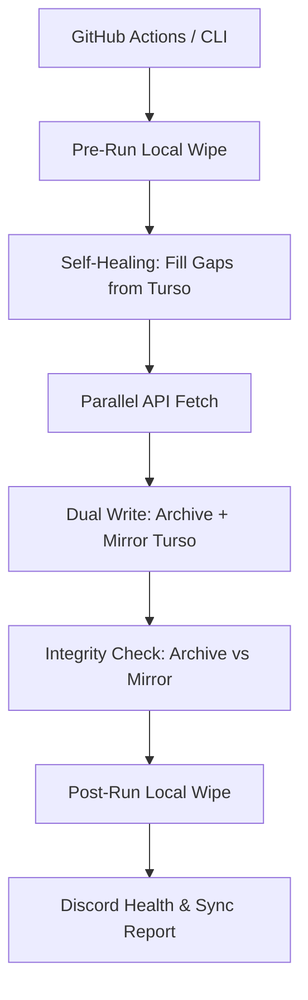

# System Architecture: Data Harvester (Pure CLI)

## 1. High-Level Overview
The **Data Harvester** is a decoupled, headless Python service optimized for **Stateless/Ephemeral** execution (GitHub Actions). It maintains data parity across two masters (Turso Archive and Turso Mirror) using a high-performance parallel fetch core.

Architecture Highlights:
- **Stateless Design**: Optimized for GitHub Actions; local storage is treated as a transient buffer.
- **Dual-Master strategy**: Data is synced to Turso Archive (Primary) and Turso Mirror (Replica).
- **Self-Healing**: Automatically repairs gaps in the local buffer from Turso before every harvest.
- **Integrity Fingerprinting**: Uses lightweight statistical fingerprints to verify sync between cloud masters.

## 2. Directory Structure

```text
├── main.py             # Main Entry Point & Orchestrator
├── .github/workflows/         # Automation Layer
├── tools/                     # Core Utility Tools (Migration, Repair)
├── src/
│   ├── api/                   # PROVIDER LAYER (Massive, Yahoo, Binance)
│   ├── data/                  # LOGIC LAYER (Harvester, Normalizer)
│   ├── database/              # STORAGE LAYER (LibSQL/Turso/SQLite)
│   └── utils/                 # CROSS-CUTTING (Discord, Integrity)
└── requirements.txt           # Environment Dependencies
```

## 3. The Harvesting & Sync Pipeline



## 4. Key Components

### A. Harvester Controller (`src/data/harvester.py`)
Orchestrates parallel workers via `ThreadPoolExecutor`. Manages provider-specific rate limiting and handles session roll-overs.

### B. Ephemeral Data Manager (`main.py`)
Manages the lifecycle of the transient database buffer. Ensures connections are explicitly closed to prevent session leaks and wipes local data at exit.

### C. Self-Healing Engine (`tools/sync_mirror_v5.py`)
Ensures no data gaps exist between runs by comparing row counts and timestamps between Turso Archive and Mirror, pulling missing data as needed.

### D. Integrity & Health (`src/utils/`)
- **Integrity**: Compares MD5-style fingerprints (statistical sums) to detect sync drift between Archive and Mirror.
- **Discord**: Time-aware health dashboard flagging tickers with low candle counts based on the current market session (PRE/REG/POST).

---
*Updated for Data Harvester v5.0 (Stateless & Self-Healing Architecture)*
