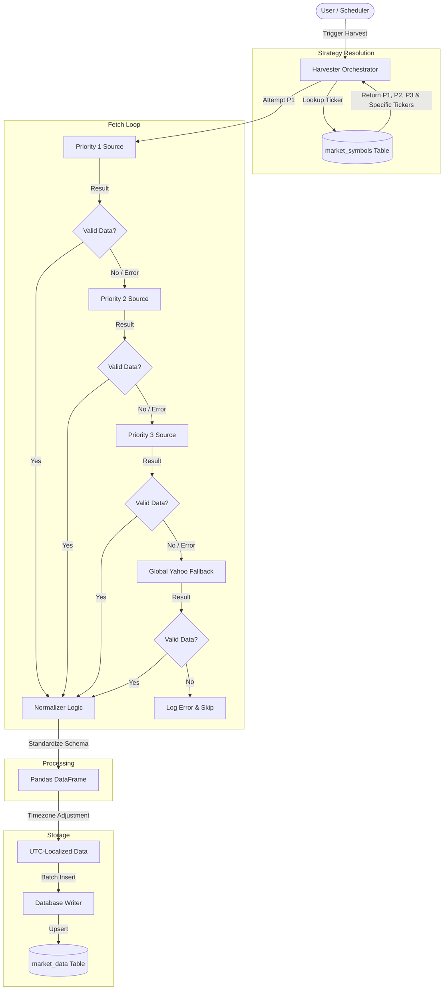

# System Architecture: Data Harvester

## 1. High-Level Overview
The **Data Harvester** is a Python-based application designed to collect, normalize, and store 1-minute intraday market data for Stocks, ETFs, Crypto, Forex, and Commodities. It uses a **Dynamic Hybrid Strategy** to fetch data from multiple providers (Polygon/Massive, Yahoo Finance, Twelve Data, Binance) based on user-defined priorities per symbol.

The system runs in two modes:
1.  **Interactive GUI**: A multi-page Streamlit web application for manual control, inventory management, and data health visualization.
2.  **CLI Automation**: A headless script (`harvest_cli.py`) designed for cron jobs or GitHub Actions to run scheduled harvests.

## 2. Directory Structure -> Component Map

```text
├── app.py                     # GUI Entry Point (Multi-page router)
├── pages/                     # Streamlit Page Definitions
│   ├── 1_🏥_Data_Health.py
│   ├── 2_🔎_DB_Inspector.py
│   ├── 3_🌾_Data_Harvester.py
│   └── 4_📦_Inventory_Manager.py
├── harvest_cli.py             # Entry Point (Automation/CLI)
├── src/
│   ├── api/                   # PROVIDER LAYER
│   │   ├── massive.py         # Primary Stock Source (Polygon.io)
│   │   ├── yahoo.py           # Fallback Stock Source / Futures
│   │   ├── twelve_data.py     # Secondary Stock Source
│   │   ├── binance.py         # Primary Crypto Source
│   │   └── retry.py           # API Request Resilience Utility
│   ├── data/                  # LOGIC LAYER
│   │   ├── harvester.py       # Core Orchestrator (The "Brain")
│   │   └── normalizer.py      # Standardizes distinct API formats into one schema
│   ├── database/              # STORAGE LAYER
│   │   ├── connection.py      # Turso (LibSQL) Connection Management
│   │   ├── operations.py      # CRUD Operations
│   │   └── schema.py          # Table Definitions (market_symbols, market_data)
│   ├── ui/                    # UI COMPONENT LAYER (Imported by pages/)
│   │   ├── inventory.py       # Inventory Logic
│   │   ├── harvester_ui.py    # Harvester Logic
│   │   └── health.py          # Data Health Logic
│   ├── utils/                 # UTILITIES
│   │   └── logger.py          # Custom Log Formatting
│   ├── config.py              # Constants & Timezones
│   ├── infisical_manager.py   # Secret Management (API Keys)
│   └── probe_keys.py          # API Key Diagnostic Utility
```

## 3. Data Flow: The Harvesting Pipeline



The core logic resides in `src/data/harvester.py`. When a harvest is triggered, the system follows this pipeline:

1.  **Input Configuration**:
    - Selects **Tickers** (from Inventory).
    - Selects **Target Date** (Today/Yesterday).
    - Selects **Mode** (Full Day, Pre-Market, Regular, Post-Market).

2.  **Strategy Resolution (Per Ticker)**:
    - The `Harvester` looks up the ticker in `market_symbols`.
    - Determines the **Priority Stack** (P1, P2, P3).
    - Resolves source-specific tickers (e.g., `AAPL` on Massive vs `AAPL` on Yahoo).

3.  **Fetch & Fallback Loop**:
    - **Attempt Pipeline**: Tries P1, then P2, then P3 sequentially.
    - **Safety Net**: If `YAHOO` is not in the pipeline, it is automatically added as a final fallback.
    - **Validation**: Checks if data is empty or malformed at each step.

4.  **Normalization**:
    - Raw data from providers is passed to `src/data/normalizer.py`.
    - Converted to a uniform DataFrame with columns: `timestamp` (UTC), `open`, `high`, `low`, `close`, `volume`, `symbol`, `session`.

5.  **Storage**:
    - Data is written to the `market_data` table in the Turso database.
    - Uses `INSERT OR REPLACE` (Upsert) to handle duplicate timestamps gracefully based on the unique `(symbol, timestamp)` constraint.

## 4. Key Subsystems

### A. Database (LibSQL/Turso)
- **`market_symbols`**: The Inventory. Stores `display_name` (PK), source-specific tickers, and priorities (P1, P2, P3).
- **`market_data`**: The "Gold Mine". A timeseries table holding millions of candle rows.
    - Primary Key: `(symbol, timestamp)` ensures strict uniqueness.
    - Time Handling: All data is stored as **UTC** strings. UI conversion to `US/Eastern` or `Asia/Bahrain` is handled at display time.

### B. Secrets Management (Infisical)
- Uses `src/infisical_manager.py` to securely fetch API keys.
- **Key Rotation**: For Massive/Polygon, it automatically rotates through keys (`...API_KEY_1`, `_2`, etc.) if it hits a Rate Limit (HTTP 429).

### C. The Multi-Page UI Architecture
- **Router**: `app.py` serves as the main entry point and sidebar navigator.
- **Pages**: Files in `pages/` define the Streamlit view logic but delegate heavy lifting (fetching, calculations) to modules in `src/ui/`.
- **States**: Uses `st.session_state` to track current selections and progress across pages.

## 5. Automation
The `harvest_cli.py` script is built for "Set and Forget" operations.
- **Smart Date Logic**: Detection of "Morning" vs "Evening" runs to decide whether to harvest *Yesterday* (if pre-market open) or *Today*.
- **Headless**: Writes logs to `stdout` instead of the Streamlit UI.
- **Resilience**: Per-ticker exception handling ensures one failed asset doesn't stop the entire queue.

---
*Updated for Data Harvester v2.1*
