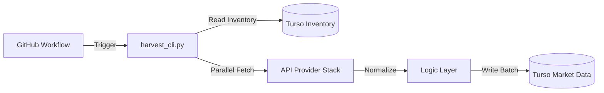

# System Architecture: Data Harvester (Pure CLI)

## 1. High-Level Overview
The **Data Harvester** is a decoupled, headless Python service dedicated to high-performance market data collection. It is designed to run as a **Producer** in a microservices-style architecture, writing normalized data into a central Turso database.

Architecture Highlights:
- **Decoupled UI**: Visualization is handled by the separate `data-viewer` repository.
- **Parallel Core**: Uses `ThreadPoolExecutor` to maximize API throughput.
- **Automated**: Integrated with GitHub Actions for daily scheduled runs.

## 2. Directory Structure

```text
├── harvest_cli.py             # Main Entry Point (Automation)
├── .github/workflows/         # Automation Layer
│   └── harvest.yml            # GitHub Actions Configuration
├── src/
│   ├── api/                   # PROVIDER LAYER (Capital.com, Yahoo, Binance)
│   ├── data/                  # LOGIC LAYER (Harvester, Normalizer)
│   └── database/              # STORAGE LAYER (LibSQL/Turso)
├── README.md                  # Project Documentation
└── requirements.txt           # CLI-Only Dependencies
```

## 3. The Harvesting Pipeline



## 4. Key Components

### A. Harvester Controller (`src/data/harvester.py`)
The orchestrator that manages the worker pool. It ensures symbols are processed concurrently while respecting provider-specific rate limits and fallback logic.

### B. Secret Management (`src/infisical_manager.py`)
A singleton manager that handles secure retrieval and caching of API credentials via Infisical. Supports local `.env` loading for development.

### C. Storage Layer (`src/database/`)
A pure SQL-based interaction layer using `libsql-client`. All timestamps are stored as UTC for cross-timezone consistency.

---
*Updated for Data Harvester v3.1 (Capital.com Transition)*
