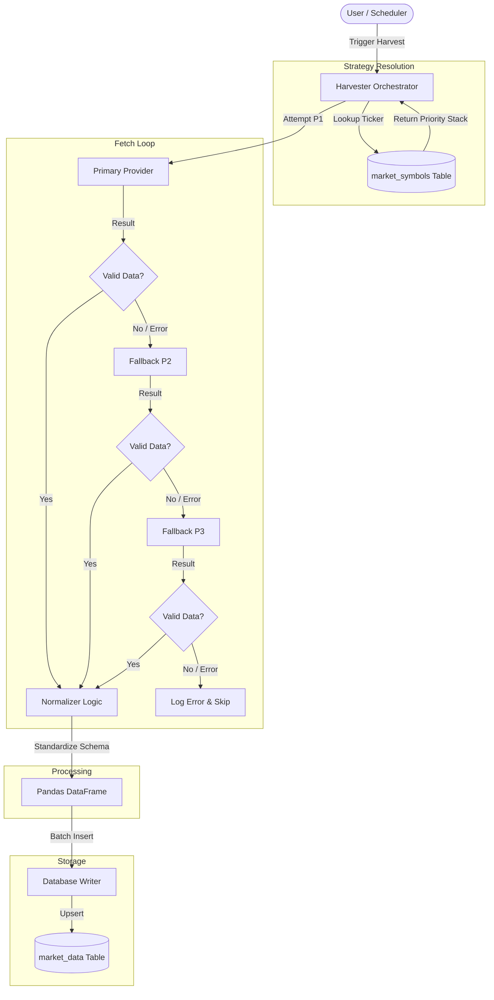

# System Architecture: Data Harvester

## 1. High-Level Overview
The **Data Harvester** is a Python-based application designed to collect, normalize, and store 1-minute intraday market data for Stocks, ETFs, Crypto, Forex, and Commodities. It uses a **Hybrid Strategy** to fetch data from multiple providers (Polygon/Massive, Yahoo Finance, Twelve Data, Binance) based on reliability and cost.

The system runs in two modes:
1.  **Interactive GUI**: A Streamlit web application for manual control, inventory management, and data health visualization.
2.  **CLI Automation**: A headless script (`harvest_cli.py`) designed for cron jobs or GitHub Actions to run scheduled harvests.

## 2. Directory Structure -> Component Map

```text
├── app.py                     # Entry Point (Streamlit GUI)
├── harvest_cli.py             # Entry Point (Automation/CLI)
├── src/
│   ├── api/                   # PROVIDER LAYER
│   │   ├── massive.py         # Primary Stock Source (Polygon.io)
│   │   ├── yahoo.py           # Fallback Stock Source / Futures
│   │   ├── twelve_data.py     # Secondary Stock Source
│   │   └── binance.py         # Primary Crypto Source
│   ├── data/                  # LOGIC LAYER
│   │   ├── harvester.py       # Core Orchestrator (The "Brain")
│   │   └── normalizer.py      # Standardizes distinct API formats into one schema
│   ├── database/              # STORAGE LAYER
│   │   ├── connection.py      # Turso (LibSQL) Connection Management
│   │   ├── operations.py      # CRUD Operations
│   │   └── schema.py          # Table Definitions (market_symbols, market_data)
│   ├── ui/                    # PRESENTATION LAYER
│   │   ├── inventory.py       # Inventory Manager Page
│   │   ├── harvester_ui.py    # Main Harvester Control Page
│   │   └── health.py          # Data Health Dashboard Page
│   ├── config.py              # Constants & Timezones
│   └── infisical_manager.py   # Secret Management (API Keys)
```

## 3. Data Flow: The Harvesting Pipeline



The core logic resides in `src/data/harvester.py`. When a harvest is triggered, the system follows this pipeline:

1.  **Input Configuration**:
    - Selects **Tickers** (from Inventory).
    - Selects **Target Date** (Today/Yesterday).
    - Selects **Mode** (Full Day, Pre-Market, Regular, Post-Market).

2.  **Strategy Resolution (Per Ticker)**:
    - The `Harvester` looks up the ticker in `market_symbols`.
    - Determines the **Priority Stack** (e.g., P1=Massive, P2=Yahoo, P3=None).

3.  **Fetch & Fallback Loop**:
    - **Attempt P1**: Tries to fetch data from the Priority 1 provider.
    - **Validation**: Checks if data is empty or malformed.
    - **Fallback**: If P1 fails, immediately switches to P2, then P3.
    - *Special Case*: For "Full Day" harvests, it stitches together Pre-Market, Regular, and Post-Market sessions, potentially from different providers if needed (though usually strictly follows the priority per session).

4.  **Normalization**:
    - Raw JSON/CSV from APIs is passed to `src/data/normalizer.py`.
    - Converted to a uniform DataFrame with columns: `timestamp` (UTC), `open`, `high`, `low`, `close`, `volume`, `symbol`, `session`.

5.  **Storage**:
    - Data is written to the `market_data` table in the Turso database.
    - Uses `INSERT OR REPLACE` to handle duplicate timestamps gracefully (idempotency).

## 4. Key Subsystems

### A. Database (LibSQL/Turso)
- **`market_symbols`**: The Inventory. Stores the configuration for each asset (Display Name, Provider Tickers, Priorities).
- **`market_data`**: The "Gold Mine". A massive Timeseries table holding millions of candle rows.
    - Primary Key: `(symbol, timestamp)` ensures strict uniqueness.

### B. Secrets Management (Infisical)
- Uses `src/infisical_manager.py` to securely fetch API keys.
- **Key Rotation**: For Massive/Polygon, it automatically rotates through keys (`...API_KEY_1`, `_2`, etc.) if it hits a Rate Limit (HTTP 429).

### C. The 3-Stage Fallback Engine
This is the system's reliability guarantee.
1.  **Massive**: Best for Stocks/ETFs (High granularity, huge history).
2.  **Twelve Data**: Good alternative, developer-friendly.
3.  **Yahoo Finance**: "Safe Haven". Used for specific Futures (`YM=F`, `CL=F`) and as a last resort for stocks.
4.  **Binance**: Dedicated lane for Crypto pairs (`BTCUSDT`).

## 5. Automation
The `harvest_cli.py` script is built for "Set and Forget" operations.
- **Smart Date Logic**: Detection of "Morning" vs "Evening" runs to decide whether to harvest *Yesterday* (if pre-market open) or *Today*.
- **Headless**: Writes logs to `stdout` instead of the Streamlit UI.
- **Error Handling**: Catches exceptions per-ticker so one bad apple doesn't crash the whole harvest.

---
*Generated for Data Harvester v2.0*
